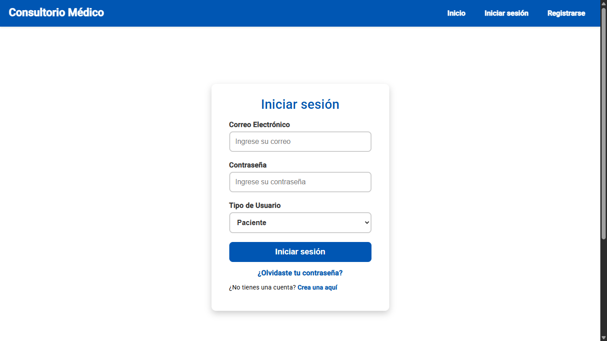
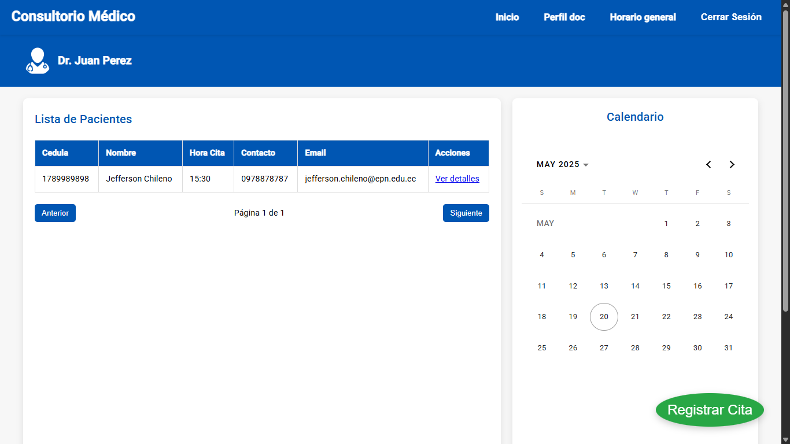
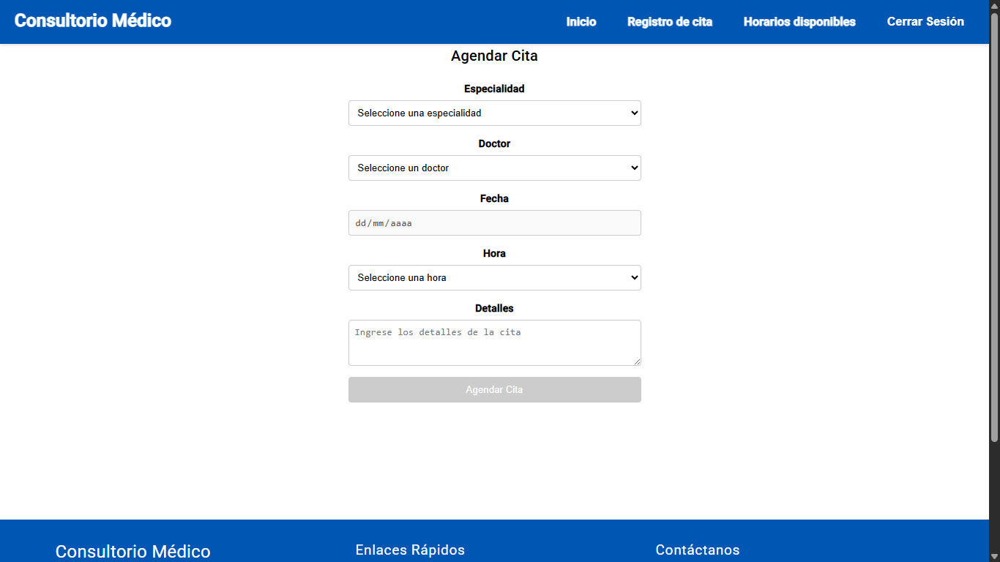
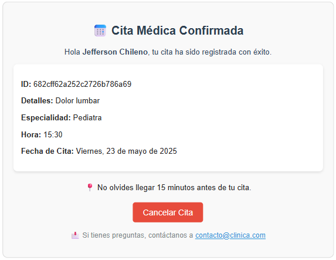

# 📅 MedicalApp – Reserva de Citas Médicas Online

Una aplicación web de **reserva de citas médicas** que permite a los pacientes registrarse, navegar por áreas de salud, consultar horarios disponibles y gestionar sus citas de forma fácil e intuitiva. Los médicos se incorporan al sistema mediante llamadas directas al API (e.g. Postman).

---

## 📌 Características Principales

- **Registro y autenticación de pacientes**  
  Los usuarios/pacientes pueden registrarse, iniciar sesión y recuperar su contraseña desde la UI.

- **Consulta de médicos y horarios**  
  - Filtrado por **áreas de salud** (cardiología, dermatología, pediatría, etc.).  
  - Visualización de franjas horarias disponibles en un calendario interactivo.

- **Gestión de citas**  
  - Al confirmar, el paciente recibe un **correo automático** con los datos de la cita.  
  - Desde ese mismo correo puede **cancelar** su cita con un solo clic.


---

## 🛠️ Tecnologías

- **Frontend**  
  - Angular (Componentes, Servicios, RxJS)  
  - HTML5 & CSS3 (Flexbox, Grid)  
  - TypeScript

- **Correo**  
  - Nodemailer para notificaciones automáticas

- **Backend**  
  - Node.js + Express [repositorio separado](https://github.com/JeffersonDaviid/citas-medicas-backend)
  - MongoDB  
  - JWT para autenticación

---

## 🚀 Instalación & Uso

1. **Clonar repositorio Frontend**  
   ```bash
   git clone https://github.com/JeffersonDaviid/Citas-medicas
   ```
2. **Iniciar aplicación**
    ```bash
    npm run install
    npm run start
    ```


 

## Capturas demo

### Página principal


### Inicio de Sesión


### Panel Principal del Usuario


### Selección de Horario


### Correo de Confirmación

